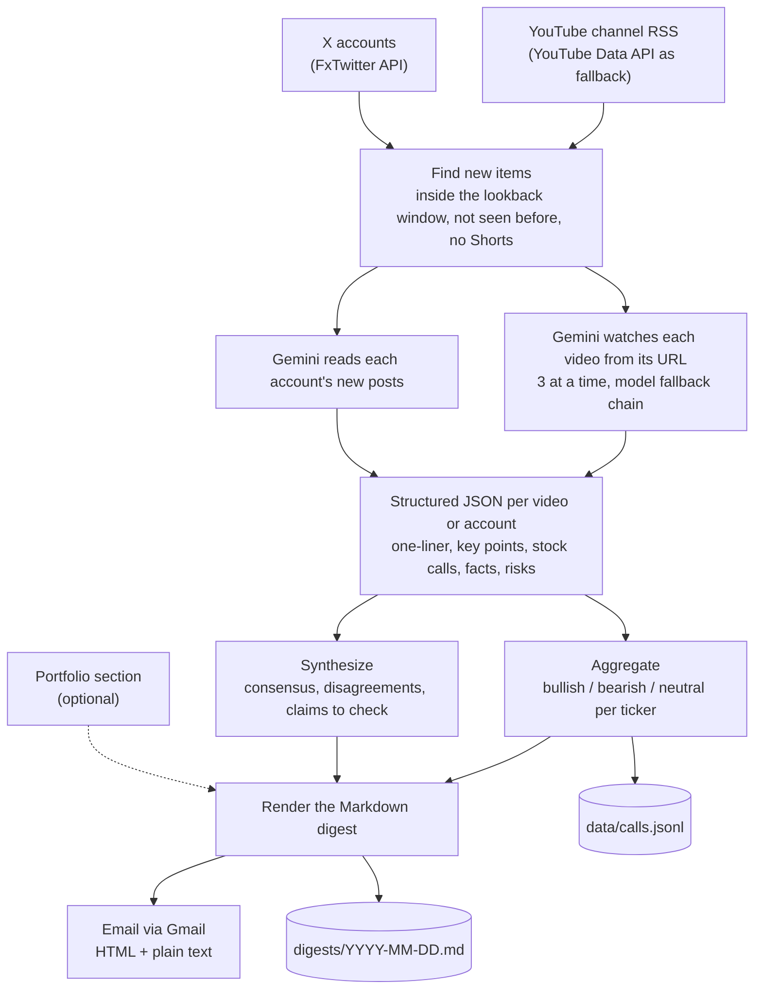

# finfluencer-digest

[](https://github.com/jackieyangjq/finfluencer-digest/actions/workflows/ci.yml)

Daily digest of finance YouTubers and X accounts: Gemini watches the videos, extracts structured stock calls, aggregates consensus, and emails you.

Once a day it collects the new videos and posts from the accounts you follow and has Gemini watch each video straight from its YouTube link. It counts who is bullish or bearish on each ticker, writes up where the bloggers agree and disagree, and emails you the result. An optional section covers your own holdings: prices, technical indicators, news, and what the bloggers said about them.

**Language.** The digest and the prompts are in Simplified Chinese, because the digest is written for Chinese readers. The channels can be in any language: the example config follows 10 Chinese and 6 English YouTube channels and 1 English X account.

## What you get

This is the top of [`docs/sample-digest.md`](docs/sample-digest.md), the output of `finfluencer-digest --demo`. In demo mode the channels, posts and model replies are made up; only the tickers are real.

> # 财经博主日报 · 2026-09-23
>
> 以下只是数据整理和博主观点汇总，不构成投资建议。
>
> ## 今日共识与分歧
>
> 今天整理了 3 个新视频和 1 个 X 账号的帖子，来自 4 位博主：示例博主·甲、示例博主·乙、示例博主·丙、示例交易员（X）。
>
> **共识**
>
> - 演示：示例博主·甲和示例博主·丙都看多 QQQ，理由分别是科技龙头盈利上修和降息预期。
> - 演示：示例博主·乙和示例交易员（X）都看空 TSLA，都担心降价拖累利润。
>
> **分歧**
>
> - 演示：NVDA：示例博主·甲和示例交易员（X）看多（数据中心需求强劲、放量突破），示例博主·丙看空（估值已经透支）。
> - 演示：AAPL：示例博主·丙看多（回购托底），示例博主·甲中性（换机潮还没出现）。
>
> **值得自己核实**
>
> - 演示：示例博主·甲说主要云厂商资本开支同比增长 40%（虚构数字），可以对照各家云厂商的财报。
> - 演示：示例博主·乙说汽车业务毛利率降到 16%（虚构数字），可以对照特斯拉的季报。
> - 演示：示例交易员（X）说 NVDA 是放量突破，可以自己看成交量是否真的放大。
>
> ## 你关注的股票
>
> …

The full digest goes on with the tickers on your watchlist (你关注的股票), a table of bullish, bearish and neutral calls per ticker (个股提及统计), the key points of each video or X account (各博主要点), and a last line with the day's Gemini calls and tokens. It arrives as an HTML email with the Markdown as the plain-text part, and a copy is saved to `digests/`.

## How it works



Real runs and the demo share one pipeline, `run_digest` in `cli.py`. After the email is sent, the IDs of processed videos and posts go to `state/seen.json` (kept for 60 days) so nothing is summarized twice, and the day's calls are appended to `data/calls.jsonl`. A video that fails is not marked as processed, so the next run retries it while it is still inside the lookback window (36 hours in the example config). `--demo` runs the same pipeline with the network and Gemini replaced by files shipped in the package: RSS feeds, an X API reply and recorded model responses.

## Design decisions

### Gemini watches the video itself

Nothing is downloaded or transcribed. The YouTube URL goes to Gemini as `file_data.file_uri`, and Gemini watches and listens on its own. To keep that cheap, it samples 0.2 frames per second (`video_fps`) at low media resolution (`media_resolution`) and stops after the first 50 minutes of each video (`max_minutes`); finance videos are mostly talk, and this was measured at about 38 tokens per second of video. The costs: reading YouTube links is still a preview feature that Google may change or start charging for, only public videos work, and the free tier covers about 8 hours of video a day.

### Models fall back in order

During a run, every Gemini request goes through `Gemini.generate` in `llm.py`, which tries a list of models in order. In the example config, videos use gemini-3.8-flash → gemini-3.5-flash → gemini-3.5-flash-lite, and the synthesis, X posts and portfolio analysis use `synth_models`, which lists the same three (with billing on, gemini-3.1-pro-preview can go first). Each model gets up to 3 attempts: errors that are usually temporary (no HTTP status code, or 500, 502, 503, 504) are retried after 30 and then 60 seconds (30 × 2^i), while any other error, such as 429 (quota or rate limit), moves on to the next model at once. If every model fails, the video or X account is listed as failed at the end of the digest and retried on the next run. The usage line at the bottom of each digest shows calls and tokens for the models that actually answered.

### Scheduled runs pass a gate first

GitHub's free scheduler can start a run late or drop it when it is busy, so one fixed trigger time is not reliable. The deployment template ([`deploy/daily-digest.yml`](deploy/daily-digest.yml)) wakes up every 30 minutes from 07:10 to 10:40 UTC, and a gate job runs `finfluencer-digest gate` (`gate.py`) before anything else. The gate lets the run through only after 08:00 UK time, and only if today's `digests/YYYY-MM-DD.md` does not exist yet. The run commits that file back to the repository, so later checks that day stop at the gate, and a dropped check is simply caught up by the next one. The result is at most one email a day (one exception is listed under [Limitations](#limitations)); manual runs skip the gate.

### News bullets must cite a source the program fetched

This applies to the optional portfolio section. Gemini sorts each holding's news from the last 7 days into good-news and bad-news bullets, and the output schema asks for every bullet to end with its date and source, such as (09-22 Reuters). `cited_only` in `portfolio/section.py` keeps a bullet only if that source matches a news item the program actually fetched from Longbridge, Finnhub, Google News or Yahoo Finance. That drops bullets where the model passed off a technical indicator as news or made up a source; if nothing is left, the card lists the fetched headlines instead. Gemini only sees public data here, such as tickers, prices, indicators, analyst targets, news and the bloggers' views,, never your quantities, costs or amounts.

### Every call is logged for scoring later

Each blogger's view on each ticker is appended to `data/calls.jsonl`, one JSON line per call: date, channel, video ID, ticker, name, stance (看多 / 看空 / 中性, that is bullish / bearish / neutral) and the one-sentence reason (`call_rows` in `aggregate.py`, `save_calls` in `state.py`). Lines are written only after the email has gone out, never in dry runs or the demo. The point is to score the bloggers later: set against the price moves that followed, the file gives each blogger's real hit rate (see [Roadmap](#roadmap)). The portfolio section already reads the past week of it back to show what bloggers said about each of your holdings.

## Numbers

| What | Number |
|---|---|
| Sources | 16 YouTube channels (10 Chinese, 6 English) |
| One real run over all 16 channels (22 September 2026) | 16 videos (15 about markets, 1 skipped as off-topic), 17 Gemini calls including the synthesis |
| Gemini usage in that run | gemini-3.5-flash: 12 calls, about 590k input and 38k output tokens<br>gemini-3.5-flash-lite: 5 calls, about 216k input and 3k output tokens |
| Cost | $0, within Gemini's free tier |
| A typical day (estimate) | about 12 new videos; the run takes about 15 minutes, 3 videos at a time |
| Demo mode | no network, finishes in under 1 second |

## Run it

Needs Python 3.12 or later. The package is not on PyPI yet, so install it from GitHub and run the demo:

```bash
pip install "finfluencer-digest @ git+https://github.com/jackieyangjq/finfluencer-digest"
finfluencer-digest --demo
```

Or run it once with uv, without a permanent install:

```bash
uv tool run --from "git+https://github.com/jackieyangjq/finfluencer-digest" finfluencer-digest --demo
```

The demo runs the whole pipeline on made-up channels, posts and recorded model replies: no config, keys, network or email. It prints the digest and saves it to `demo-output/2026-09-23.md` (`--out DIR` picks another folder).

For real use you need a Gemini API key (the free tier is enough) and a Gmail account with an app password. Three steps, in a folder of your own:

```bash
# 1. Config and keys: edit the channel list in config.yaml; fill in GEMINI_API_KEY, GMAIL_ADDRESS
#    and GMAIL_APP_PASSWORD in .env (the file says where to get each one)
curl -fsSLo config.yaml https://raw.githubusercontent.com/jackieyangjq/finfluencer-digest/main/config.example.yaml
curl -fsSLo .env https://raw.githubusercontent.com/jackieyangjq/finfluencer-digest/main/.env.example

# 2. Check the Gemini key and every configured model, the Gmail login, each channel and X account
finfluencer-digest --check

# 3. One video end to end: the digest is saved to digests/, nothing is emailed or marked as processed
finfluencer-digest --limit 1 --dry-run
```

After that, `finfluencer-digest` does a real run; the digest goes to `GMAIL_ADDRESS` unless you set `EMAIL_TO`. Keys can also come from environment variables instead of `.env`. `--config PATH` points to a config elsewhere, and `state/`, `data/` and `digests/` are always written next to the config file. To add a channel, `finfluencer-digest --find-channel @handle` prints its ID. The portfolio section is off by default. It needs the extra (`pip install "finfluencer-digest[portfolio] @ git+https://github.com/jackieyangjq/finfluencer-digest"`), `portfolio.enabled: true` in `config.yaml` and a holdings file; see [the portfolio part of the deployment guide](deploy/README.md#portfolio-section-optional).

## Deploy

It is built to run on GitHub Actions' free scheduler, with nothing left running on your own machine. A private repository of yours holds `config.yaml` (and holdings files, if you use the portfolio section), your keys go into Actions secrets, and each run installs a pinned release of this package and commits the digest and run records back. [`deploy/README.md`](deploy/README.md) walks through the setup, and [`deploy/daily-digest.yml`](deploy/daily-digest.yml) is the workflow to copy.

## Limitations

- Gemini's free tier handles about 8 hours of YouTube video a day. Reading YouTube links directly is still a preview feature, and Google may change the rules or start charging.
- Only public videos work. Members-only videos end up in the list of failures at the end of the digest.
- YouTube channel RSS feeds sometimes fail for cloud servers. If the digest keeps reporting 视频列表获取失败 ("could not fetch the video list"), get a YouTube Data API key and set it as `YOUTUBE_API_KEY`; the program then falls back to the API on its own.
- X accounts are read through the free FxTwitter API, which is unofficial and may stop working. Failures are listed at the end of the digest and do not affect the rest.
- The 08:00 cut-off and the digest date follow UK time (Europe/London), fixed in `config.py` for now.
- One exception to one email a day: if there are new videos and every one of them fails, the run still emails the digest, then exits with an error so that GitHub notifies you. The template then skips saving the archive, so each later check that morning runs again and can send another email.
- The digest only collects what the bloggers said. It is not investment advice.

## Tests

```bash
git clone https://github.com/jackieyangjq/finfluencer-digest && cd finfluencer-digest
pip install -e ".[dev,portfolio]"
ruff check . && pytest -q
```

The tests never touch the network and need no keys. Gemini is replaced by a stub or by recorded replies, the feeds and the clock are passed in, and nothing actually sleeps. They cover the per-ticker tally, feed parsing and video filtering, rendering, the fallback and retry rules, the state files, the gate, the news source check, the technical indicators, and the full demo run with network access blocked, including a check that `docs/sample-digest.md` still matches the demo output. Without the `[portfolio]` extra, the portfolio tests are skipped. CI runs ruff, the tests and the demo on every push to main and every pull request.

## Repository layout

```
src/finfluencer_digest/
├── cli.py              command line; run_digest, the one pipeline for real runs and --demo
├── config.py           reads config.yaml and .env; UK time zone
├── youtube.py          new videos from channel RSS (YouTube Data API as fallback); --find-channel
├── x_posts.py          new X posts through the FxTwitter API
├── summarize.py        prompts and output schema: watch a video, read X posts, write the synthesis
├── llm.py              Gemini wrapper: fallback chain, retries, usage; recorded replies for --demo
├── aggregate.py        bullish / bearish / neutral tally per ticker; rows for calls.jsonl
├── render.py           the Markdown digest and its email HTML
├── mailer.py           sends the digest through Gmail (HTML + plain text)
├── state.py            run records: state/seen.json, data/calls.jsonl, digests/
├── gate.py             whether a scheduled check should run now
├── check.py            --check: keys, models, Gmail login, channels, X accounts
├── demo/               made-up channels, posts and recorded model replies for --demo
└── portfolio/          optional holdings section (needs the [portfolio] extra)
    ├── section.py      holdings, risk flags, market line, one card per holding, cited_only
    ├── news.py         news from Longbridge, Finnhub, Google News and Yahoo Finance
    ├── technicals.py   moving averages, RSI, MACD, volume
    └── longbridge.py   Longbridge quotes and news (read-only)
tests/                  pytest suite; no network, no keys
deploy/                 GitHub Actions workflow template and setup guide
docs/sample-digest.md   the demo's output
config.example.yaml     channels, X accounts, models, portfolio settings
.env.example            keys and where to get each one
```

## Roadmap

- **Filings Q&A research agent** (October 2026): answers questions about companies from their SEC filings, with a source for every sentence.
- **finfluencer-scorecard** (November 2026): checks the calls in `data/calls.jsonl` against the price moves that followed, giving each blogger a hit rate.

## License

MIT © 2026 Jiaqi Yang. See [LICENSE](LICENSE).

## 中文说明

财经博主日报：每天找出你关注的财经 YouTube 频道和 X 账号的新内容，让 Gemini 直接看视频（不下载、不转文字），按固定格式提炼每位博主的观点和对个股的看多、看空态度，统计共识与分歧后发到你的邮箱。日报正文和提示词都是简体中文，频道可以是任何语言。可选的“我的持仓”部分会给每只持仓加上价格、技术指标、新闻和博主观点。程序只整理信息，不给买卖建议。

不需要密钥、不联网的演示（还没发布到 PyPI，也就是 Python 的官方软件包仓库，所以从 GitHub 安装）：

```bash
pip install "finfluencer-digest @ git+https://github.com/jackieyangjq/finfluencer-digest"
finfluencer-digest --demo
```

正式使用分三步：填好配置和密钥、运行 `--check` 检查、用 `--limit 1 --dry-run` 试跑一个视频，命令见上文 [Run it](#run-it)。每天自动运行的部署方法见 [deploy/README.md](deploy/README.md)。
