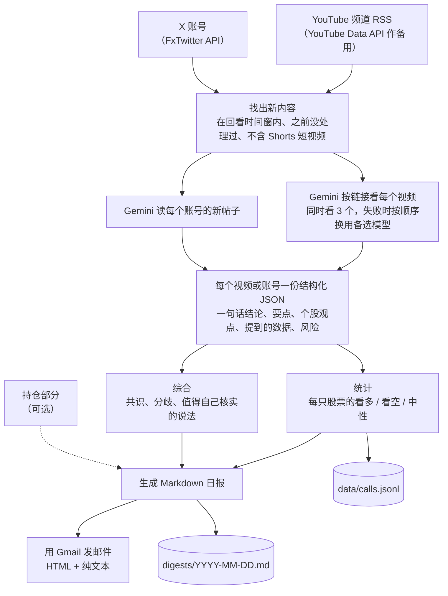

# finfluencer-digest

[English](README.md) | **简体中文**

[](https://github.com/jackieyangjq/finfluencer-digest/actions/workflows/ci.yml)

财经 YouTube 博主和 X 账号的每日摘要：Gemini 看视频，按固定格式提取个股观点，汇总共识，然后发邮件给你。

它每天运行一次：收集你关注的账号发布的新视频和新帖子，把每个视频的 YouTube 链接直接交给 Gemini 去看。然后统计每只股票谁看多、谁看空，写清楚博主们哪里看法一致、哪里有分歧，再把结果发到你的邮箱。可选的“我的持仓”部分专讲你自己的持仓：价格、技术指标（用历史价格和成交量算出的指标）、新闻，以及博主们对这些股票说了什么。

**语言。** 日报正文和提示词（发给模型的指令）都是简体中文，因为日报是写给中文读者看的。频道可以是任何语言：示例配置关注了 10 个中文、6 个英文 YouTube 频道和 1 个英文 X 账号。

## 你会收到什么

下面是 [`docs/sample-digest.md`](docs/sample-digest.md) 的开头，这个文件就是 `finfluencer-digest --demo` 的输出。演示模式里的频道、帖子和模型回复都是编的，只有股票代码是真的。

> # 财经博主日报 · 2026-09-23
>
> 以下只是数据整理和博主观点汇总，不构成投资建议。
>
> ## 今日共识与分歧
>
> 今天整理了 3 个新视频和 1 个 X 账号的帖子，来自 4 位博主：示例博主·甲、示例博主·乙、示例博主·丙、示例交易员（X）。
>
> **共识**
>
> - 演示：示例博主·甲和示例博主·丙都看多 QQQ，理由分别是科技龙头盈利上修和降息预期。
> - 演示：示例博主·乙和示例交易员（X）都看空 TSLA，都担心降价拖累利润。
>
> **分歧**
>
> - 演示：NVDA：示例博主·甲和示例交易员（X）看多（数据中心需求强劲、放量突破），示例博主·丙看空（估值已经透支）。
> - 演示：AAPL：示例博主·丙看多（回购托底），示例博主·甲中性（换机潮还没出现）。
>
> **值得自己核实**
>
> - 演示：示例博主·甲说主要云厂商资本开支同比增长 40%（虚构数字），可以对照各家云厂商的财报。
> - 演示：示例博主·乙说汽车业务毛利率降到 16%（虚构数字），可以对照特斯拉的季报。
> - 演示：示例交易员（X）说 NVDA 是放量突破，可以自己看成交量是否真的放大。
>
> ## 你关注的股票
>
> …

完整的日报接着是：“你关注的股票”（你自选清单里的股票）、“个股提及统计”（每只股票看多、看空、中性观点的统计表）、“各博主要点”（每个视频或 X 账号的要点），最后一行是当天 Gemini 的调用次数和 token 用量（token 是模型计算用量的单位）。日报以 HTML 邮件（带排版的网页格式）发出，纯文本部分就是 Markdown 原文（Markdown 是一种用简单符号标出标题、列表的纯文本格式），同时存一份到 `digests/`。

## 工作原理



正式运行和演示共用一套流程，就是 `cli.py` 里的 `run_digest`。邮件发出后，处理过的视频和帖子的 ID 会写进 `state/seen.json`（保留 60 天），这样同一条内容不会被总结两次；当天的观点追加到 `data/calls.jsonl`。处理失败的视频不会记为已处理。只要它还在回看时间窗内（程序只看最近若干小时内发布的内容，示例配置是 36 小时），下次运行就会重试。`--demo` 走的也是这套流程，只是把网络和 Gemini 换成包里自带的文件：RSS 订阅（网站公开的更新列表，程序靠它发现新视频）、一份 X 接口的回复和录好的模型回复。

## 设计决定

### 让 Gemini 自己看视频

程序不下载视频，也不转文字。YouTube 链接以 `file_data.file_uri` 的形式交给 Gemini，由它自己看画面、听声音。为了省用量，每秒只取 0.2 帧画面（`video_fps`）并用低分辨率（`media_resolution`），每个视频只看前 50 分钟（`max_minutes`）。财经视频大多是口播，按这个设置实测每秒视频约 38 个 token。代价有三点：直接读 YouTube 链接仍是预览功能（尚未正式发布的功能），Google 可能修改规则或开始收费；只支持公开视频；免费额度（不付费时能用的量）每天大约够看 8 小时视频。

### 模型失败就按顺序换下一个

运行时，所有 Gemini 请求都经过 `llm.py` 里的 `Gemini.generate`，它按列表顺序逐个尝试模型。示例配置里，看视频依次用 gemini-3.8-flash → gemini-3.5-flash → gemini-3.5-flash-lite；综合总结、读 X 帖子和持仓分析用 `synth_models`，列的也是这三个（开通付费后，可以把 gemini-3.1-pro-preview 排在第一个）。每个模型最多试 3 次。如果错误通常只是暂时的，就先等 30 秒、再等 60 秒重试（30 × 2^i）。这类错误指没有 HTTP 状态码（服务器回复里表示结果的三位数），或者状态码是 500、502、503、504。其他错误，比如 429（额度用完或请求太频繁），会立刻换下一个模型。所有模型都失败时，这个视频或 X 账号会列在日报末尾的失败清单里，下次运行再试。每份日报底部的用量行，显示的是真正给出回答的那些模型的调用次数和 token 数。

### 定时运行先经过把关检查

GitHub 的免费定时服务在繁忙时可能晚启动，甚至直接丢掉某次运行，所以只设一个固定的触发时间并不可靠。部署模板（[`deploy/daily-digest.yml`](deploy/daily-digest.yml)）在世界标准时间（UTC）07:10 到 10:40 之间每 30 分钟唤醒一次，每次先运行一个把关任务 `finfluencer-digest gate`（`gate.py`），再做别的。只有英国时间过了 08:00，而且今天的 `digests/YYYY-MM-DD.md` 还不存在，它才放行。这次运行结束时会把这个文件提交回仓库，所以当天之后的检查都会被拦下；某次检查被丢掉了，下一次会自然补上。结果是一天最多一封邮件（有一个例外，见[局限](#局限)）；手动运行不经过把关。

### 新闻条目必须引用程序真正抓到的来源

这一条针对可选的持仓部分。Gemini 把每只持仓最近 7 天的新闻整理成利好、利空两类条目，规定的输出格式要求每条末尾写上日期和来源，比如（09-22 Reuters）。`portfolio/section.py` 里的 `cited_only` 只保留来源对得上的条目：这个来源必须对应程序真正从长桥（Longbridge）、Finnhub、Google 新闻或雅虎财经抓到的某条新闻。这样就去掉了模型把技术指标说成新闻、或者编造来源的条目；如果一条都不剩，这只持仓的卡片就改为列出抓到的新闻标题。这里 Gemini 只能看到公开数据，比如股票代码、价格、技术指标、分析师目标价、新闻和博主观点，从来看不到你的持股数量、成本或金额。

### 每条观点都记下来，以后用来打分

每位博主对每只股票的看法都会追加到 `data/calls.jsonl`，一条观点一行 JSON（一种通用的数据格式），包括：日期、频道、视频 ID、股票代码、股票名称、态度（看多 / 看空 / 中性）和一句话理由（见 `aggregate.py` 里的 `call_rows` 和 `state.py` 里的 `save_calls`）。只有邮件发出后才写入，试运行（dry run）和演示都不写。目的是以后给博主打分：拿这些观点和之后的实际涨跌对照，就能算出每位博主真实的命中率（看对的比例，见[后续计划](#后续计划)）。持仓部分现在已经会读回最近一周的记录，显示博主们对你每只持仓说了什么。

## 关键数字

| 项目 | 数字 |
|---|---|
| 来源 | 16 个 YouTube 频道（10 个中文、6 个英文） |
| 一次覆盖全部 16 个频道的真实运行（2026 年 9 月 22 日） | 16 个视频（15 个讲市场，1 个与市场无关、已跳过），Gemini 调用 17 次（含综合总结） |
| 这次运行的 Gemini 用量 | gemini-3.5-flash：12 次调用，输入约 590k、输出约 38k token<br>gemini-3.5-flash-lite：5 次调用，输入约 216k、输出约 3k token |
| 费用 | $0，在 Gemini 免费额度之内 |
| 平常一天（估计） | 约 12 个新视频；同时处理 3 个视频，整次运行约 15 分钟 |
| 演示模式 | 不联网，不到 1 秒跑完 |

## 运行

需要 Python 3.12 或更高版本。这个包还没发布到 PyPI（Python 官方的软件包仓库），所以从 GitHub 安装，然后运行演示：

```bash
pip install "finfluencer-digest @ git+https://github.com/jackieyangjq/finfluencer-digest"
finfluencer-digest --demo
```

也可以用 uv（一个 Python 包管理工具）直接运行一次，不用正式安装：

```bash
uv tool run --from "git+https://github.com/jackieyangjq/finfluencer-digest" finfluencer-digest --demo
```

演示会用虚构的频道、帖子和录好的模型回复把整个流程跑一遍：不需要配置文件、密钥和网络，也不发邮件。它会打印日报，并保存到 `demo-output/2026-09-23.md`（用 `--out DIR` 可以换一个文件夹）。

正式使用需要一个 Gemini API 密钥（程序调用 Gemini 时用的凭证；免费额度就够用），和一个设置了应用专用密码的 Gmail 账号（应用专用密码是 Google 为单个程序生成的登录密码）。在你自己的文件夹里分三步：

```bash
# 1. 配置和密钥：在 config.yaml 里改频道列表；在 .env 里填好 GEMINI_API_KEY、GMAIL_ADDRESS
#    和 GMAIL_APP_PASSWORD（文件里写了每一项去哪里申请）
curl -fsSLo config.yaml https://raw.githubusercontent.com/jackieyangjq/finfluencer-digest/main/config.example.yaml
curl -fsSLo .env https://raw.githubusercontent.com/jackieyangjq/finfluencer-digest/main/.env.example

# 2. 检查 Gemini 密钥和配置里的每个模型、Gmail 登录、每个频道和 X 账号
finfluencer-digest --check

# 3. 从头到尾处理一个视频：日报存到 digests/，不发邮件，也不记为已处理
finfluencer-digest --limit 1 --dry-run
```

之后运行 `finfluencer-digest` 就是正式运行；日报发到 `GMAIL_ADDRESS`，设置了 `EMAIL_TO` 就改发到那里。密钥也可以用环境变量（在系统或终端里预先设好的变量）提供，不一定写在 `.env` 里。`--config PATH` 可以指定放在别处的配置文件；`state/`、`data/` 和 `digests/` 总是写在配置文件旁边。要加频道，用 `finfluencer-digest --find-channel @handle` 就能查出它的 ID。持仓部分默认关闭。打开它需要三样：一是装上可选组件（包名后方括号里的那部分额外依赖），命令是 `pip install "finfluencer-digest[portfolio] @ git+https://github.com/jackieyangjq/finfluencer-digest"`；二是在 `config.yaml` 里设 `portfolio.enabled: true`；三是准备一个持仓文件。详见部署说明（英文）里的[持仓部分](deploy/README.md#portfolio-section-optional)。

## 部署

它是按 GitHub Actions（GitHub 自带的自动化运行服务）的免费定时功能设计的，你自己的电脑上不用一直开着任何程序。你的私有仓库里放 `config.yaml`（用持仓部分的话，还要放持仓文件）。密钥存进 Actions secrets（GitHub 为仓库加密保存的密钥）。每次运行都会安装本包的一个固定版本，再把日报和运行记录提交回仓库。设置步骤见 [`deploy/README.md`](deploy/README.md)（英文）；要复制的工作流文件（规定 GitHub Actions 什么时候运行、运行什么的配置）是 [`deploy/daily-digest.yml`](deploy/daily-digest.yml)。

## 局限

- Gemini 免费额度每天大约能处理 8 小时 YouTube 视频。直接读 YouTube 链接仍是预览功能，Google 可能修改规则或开始收费。
- 只支持公开视频。会员专享视频会出现在日报末尾的失败清单里。
- 云服务器有时读不到 YouTube 频道的 RSS 订阅。如果日报一直报“视频列表获取失败”，就申请一个 YouTube Data API 密钥，设为 `YOUTUBE_API_KEY`，程序会自动改用这个接口。
- X 账号通过免费的 FxTwitter API 读取。这个接口是非官方的，可能会失效。读取失败会列在日报末尾，不影响其他内容。
- 08:00 这个分界点和日报日期都按英国时间（Europe/London）计算，目前写死在 `config.py` 里。
- “一天一封邮件”有一个例外：如果有新视频但全部处理失败，这次运行仍会发出日报，然后以错误状态退出，让 GitHub 通知你。这种情况下模板会跳过保存存档，所以那天上午之后的每次检查都会重新运行，可能再发一封邮件。
- 日报只汇总博主说了什么，不构成投资建议。

## 测试

```bash
git clone https://github.com/jackieyangjq/finfluencer-digest && cd finfluencer-digest
pip install -e ".[dev,portfolio]"
ruff check . && pytest -q
```

测试完全不联网，也不需要密钥。Gemini 换成了桩函数（只返回固定结果的替身）或录好的回复，订阅数据和当前时间由测试直接传入，需要等待的地方也不会真的等。测试覆盖：按股票的统计、订阅解析和视频筛选、日报生成、备选和重试规则、状态文件、定时把关、新闻来源检查、技术指标，以及在禁止联网的情况下完整跑一遍演示，其中会检查 `docs/sample-digest.md` 是否仍和演示输出一致。没装 `[portfolio]` 可选组件时，持仓相关的测试会跳过。CI（持续集成，代码一有改动就自动跑检查）在每次推送到 main 分支、以及每个拉取请求（pull request，申请把改动合并进来）时，都会运行 ruff（Python 代码检查工具）、测试和演示。

## 仓库结构

```
src/finfluencer_digest/
├── cli.py              命令行入口；run_digest 是正式运行和 --demo 共用的那套流程
├── config.py           读取 config.yaml 和 .env；英国时区
├── youtube.py          从频道 RSS 找新视频（YouTube Data API 作备用）；--find-channel
├── x_posts.py          通过 FxTwitter API 读取 X 新帖子
├── summarize.py        提示词和输出格式：看视频、读 X 帖子、写综合总结
├── llm.py              Gemini 调用封装：备选模型、重试、用量；--demo 用的录制回复
├── aggregate.py        按股票统计看多 / 看空 / 中性；生成写入 calls.jsonl 的行
├── render.py           Markdown 日报和对应的邮件 HTML
├── mailer.py           通过 Gmail 发送日报（HTML + 纯文本）
├── state.py            运行记录：state/seen.json、data/calls.jsonl、digests/
├── gate.py             判断某次定时检查现在该不该运行
├── check.py            --check：密钥、模型、Gmail 登录、频道、X 账号
├── demo/               --demo 用的虚构频道、帖子和录好的模型回复
└── portfolio/          可选的持仓部分（需要 [portfolio] 可选组件）
    ├── section.py      持仓、风险提示、盘面、每只持仓一张卡片、cited_only
    ├── news.py         新闻来源：长桥、Finnhub、Google 新闻和雅虎财经
    ├── technicals.py   均线、RSI、MACD、成交量
    └── longbridge.py   长桥行情和新闻（只读）
tests/                  pytest 测试；不联网、不需要密钥
deploy/                 GitHub Actions 工作流模板和设置说明
docs/sample-digest.md   演示的输出
config.example.yaml     频道、X 账号、模型、持仓设置
.env.example            密钥，以及每一项去哪里申请
```

## 后续计划

- **财报问答研究助手**（2026 年 10 月至 11 月）：根据公司向美国证监会（SEC）提交的文件（年报、季报等）回答关于公司的问题，每句话都注明出处。
- **观点记分牌**（2026-09-24 已在 [catfolio fork](https://github.com/jackieyangjq/catfolio) 里上线，上游 [PR #7](https://github.com/irrwood/catfolio/pull/7)）：导入 `data/calls.jsonl`，把每条观点和之后的实际涨跌对照，给每位博主算出命中率和“每次都跟”的净值曲线。

## 许可证

MIT © 2026 Jiaqi Yang（MIT 是一种宽松的开源许可证）。全文见 [LICENSE](LICENSE)。
